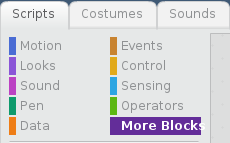

Mae angen yr estyniad Pi GPIO yn Scratch 2 ar y Raspberry Pi i reoli a darllen cydrannau mewnbwn ac allbwn sy'n gysylltiedig â'r pinnau GPIO.

- Gyda Scratch 2 ar agor, clicia ar **More Blocks** yn y ddewislen Sgriptiau.
    
    

- Nesaf clicia ar y botwm **Add an Extension**.
    
    

- Yna galli di glicio ddwywaith ar yr estyniad Pi GPIO i'w ychwanegu.
    
    

- Nawr dylet ti weld y blociau Pi GPIO yn adran **More Blocks**.
    
    
    
    