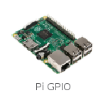

La extensión Pi GPIO en Scratch 2 en la Raspberry Pi es necesaria para controlar y leer los componentes de entrada y salida conectados a los pines GPIO.

- Con Scratch 2 abierto, haz clic en **More Blocks** (Más bloques) en el menú Scripts.
    
    

- A continuación, haz clic en el botón **Add an Extension **(Agregar una extensión).
    
    

- Luego puedes hacer doble clic en la extensión Pi GPIO para agregarla.
    
    

- Ahora deberías ver los bloques Pi GPIO en la sección **More Blocks**(Más bloques).
    
    
    
    