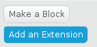

De Pi GPIO-uitbreiding in Scratch 2 op de Raspberry Pi is nodig om invoer- en uitvoercomponenten die op de GPIO-pinnen zijn aangesloten te lezen en te kunnen besturen.

- Klik terwijl Scratch 2 geopend is op **Meer blokken** in het menu Scripts.
    
    

- Klik vervolgens op de **Een uitbreiding toevoegen** knop.
    
    

- Je kunt vervolgens dubbelklikken op de Pi GPIO-extensie om deze toe te voegen.
    
    

- Je zou nu de Pi GPIO-blokken in de **Meer blokken** sectie moeten zien.
    
    
    
    