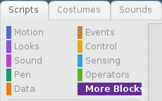

The Pi GPIO extension in Scratch 2 on the Raspberry Pi is needed to control and read input and output components connected to the GPIO pins.

- With Scratch 2 open, click on **More Blocks** in the Scripts menu.
    
    

- Next click on the **Add an Extension** button.
    
    

- You can then double-click on the Pi GPIO extension to add it.
    
    

- You should now see the Pi GPIO blocks in the **More Blocks** section.
    
    
    
    